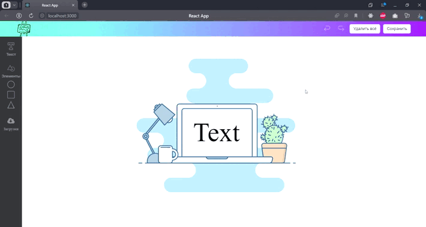

# FabricJs и React приложение

Это приложение разработано с использованием библиотеки FabricJs и React для создания интерактивного редактора, позволяющего добавлять элементы на рабочую область, включая текст, SVG фигуры и загруженные с компьютера изображения.

## Функционал

### Рабочая область (Canvas)

Приложение предоставляет рабочую область, на которую можно добавлять различные элементы. Включенные в выборе элементы в боковой панели могут быть:

- Текст: Вы можете добавить текстовый элемент на рабочую область, выбрав эту опцию в боковой панели. Вы сможете редактировать размер текста.

- SVG фигуры: Вы можете добавлять SVG фигуры на рабочую область. Это может быть треугольник, круг, прямоугольник. При клике в боковой понеле на "Элементы", появляется выподающий список из которого можно добавить выбранный элемент в рабочую область.

- Загруженные изображения: Вы можете загружать собственные изображения с компьютера. Нажмите кнопку загрузки в боковой панели, выберите файл с компьютера и добавьте его. Вы сможете масштабировать и перемещать изображение по вашему усмотрению.

### Кнопка "Сохранить"

Приложение предоставляет кнопку "Сохранить", которая отображается в шапке приложения. При нажатии на эту кнопку появляется модальное окно, в котором отображается SVG код текущего дизайна, созданного на рабочей области.

### Кнопка "Удалить всё"

Приложение предоставляет кнопку "Сохранить", которая отображается в шапке приложения. При нажатии на эту кнопку удаляются все элементы с рабочей области.

### Опциональный функционал

В приложении также реализован функционал для кнопок "Отменить" и "Повторить" предоставленные в шапке приложения. Вы можете использовать кнопку "Отменить", чтобы откатить предыдущие изменения на рабочей области, а кнопку "Повторить" для возврата к отмененным изменениям.

## Особенности

- Интуитивный интерфейс: Приложение имеет простой и интуитивно понятный интерфейс.
- Поддержка различных типов элементов: Вы можете добавлять текст, SVG фигуры и загруженные изображения на рабочую область.
- Сохранение дизайна в SVG: Приложение предоставляет возможность сохранить созданный дизайн в виде SVG кода, который может быть использован в других проектах или программах.
- История изменений: Опциональный функционал для отмены и повтора изменений на рабочей области позволяет легко откатывать и возвращать предыдущие изменения.

## Технологии

React, FabricJs, TypeScript, SCSS + БЭМ, Git
